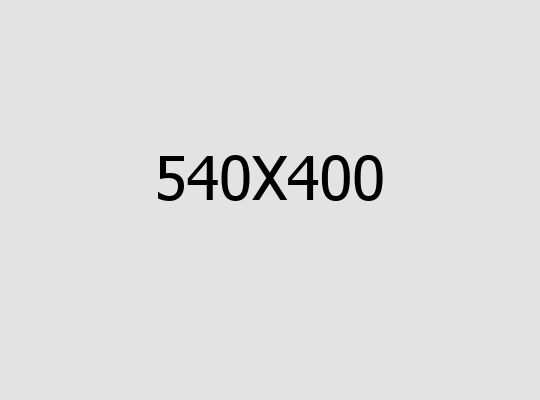
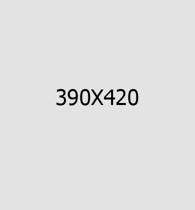

# 🚀 Panduan Integrasi Index-2 ke Index.html

## 📋 Overview

Dokumen ini berisi instruksi lengkap untuk menambahkan semua sections terbaik dari `index-2.html` ke dalam `index.html` untuk membuat homepage yang sempurna.

---

## 🎯 Sections yang Akan Ditambahkan

### Dari Index-2.html:
1. ✅ **Services Two** - Layout dengan video di tengah (line 418-517)
2. ✅ **Counter Two** - Animated counters dengan layout menarik (line 519-619)
3. ✅ **Gallery Two** - Our Working Gallery carousel (line 621-721)
4. ✅ **Testimonials Two** - Layout khusus testimonials (line 739-841)
5. ✅ **Team Two** - Meet Our Experts (line 843-966)
6. ✅ **Pricing One** - Explore Our Digital Pricing (line 968-1054)
7. ✅ **Feature One** - Scrolling text animation (line 1056-1071)
8. ✅ **Blog Two** - Latest Our Blogs layout (line 1073-1153)

---

## 📍 Lokasi Penambahan

**Insert Point**: Sebelum section "Slogan One" (line 1576 di index.html)

```
<!--End Blog One --> (line 1574)

[INSERT ALL INDEX-2 SECTIONS HERE]

<!--Start Slogan One --> (line 1576)
```

---

## 📝 Step-by-Step Instructions

### Step 1: Backup File

```bash
# Backup index.html
cp index.html index.html.backup
```

### Step 2: Copy Sections dari index-2.html

Buka `index-2.html` dan copy sections berikut:

#### Section 1: Services Two (Lines 418-517)
```html
<!--Start Services Two -->
<section class="services-two">
    ... (copy seluruh section)
</section>
<!--End Services Two -->
```

#### Section 2: Counter Two (Lines 519-619)
```html
<!--Start Counter Two -->
<section class="counter-two">
    ... (copy seluruh section)
</section>
<!--End Counter Two -->
```

#### Section 3: Gallery Two (Lines 621-721)
```html
<!--Start Gallery Two -->
<section class="gallery-two">
    ... (copy seluruh section)
</section>
<!--End Gallery Two -->
```

#### Section 4: Brand One (Lines 723-737)
```html
<!--Start Brand One -->
<section class="brand-one brand-one--two">
    ... (copy seluruh section)
</section>
<!--End Brand One -->
```

#### Section 5: Testimonials Two (Lines 739-841)
```html
<!--Start Testimonials Two -->
<section class="testimonials-two">
    ... (copy seluruh section)
</section>
<!--End Testimonials Two -->
```

#### Section 6: Team Two (Lines 843-966)
```html
<!--Start Team Two -->
<section class="team-two">
    ... (copy seluruh section)
</section>
<!--End Team Two -->
```

#### Section 7: Pricing One (Lines 968-1054)
```html
<!--Start Pricing One -->
<section class="pricing-one">
    ... (copy seluruh section)
</section>
<!--End Pricing One -->
```

#### Section 8: Feature One - Scrolling Text (Lines 1056-1071)
```html
<!--Feature One Start-->
<section class="feature-one">
    ... (copy seluruh section)
</section>
<!--Feature One End-->
```

#### Section 9: Blog Two (Lines 1073-1153)
```html
<!--Start Blog Two -->
<section class="blog-two">
    ... (copy seluruh section)
</section>
<!--End Blog Two -->
```

### Step 3: Paste ke index.html

1. Buka `index.html`
2. Cari line 1574: `<!--End Blog One -->`
3. Setelah line ini, paste SEMUA sections yang sudah dicopy
4. Pastikan paste sebelum `<!--Start Slogan One -->`

---

## 📐 Struktur Akhir index.html

```
<!DOCTYPE html>
<html>
<head>...</head>
<body>
    <!-- Preloader -->
    <!-- Sidebar -->
    <!-- Header -->
    
    <!-- Main Slider -->
    <!-- Brand One -->
    <!-- About One -->
    <!-- Advantages One -->
    <!-- Counter One -->
    <!-- Services One -->
    <!-- (sections lain yang sudah ada...) -->
    <!-- Blog One -->
    
    <!-- ==== SECTIONS BARU DARI INDEX-2 ==== -->
    <!-- Services Two -->
    <!-- Counter Two -->
    <!-- Gallery Two -->
    <!-- Brand One Two -->
    <!-- Testimonials Two -->
    <!-- Team Two -->
    <!-- Pricing One -->
    <!-- Feature One (Scrolling Text) -->
    <!-- Blog Two -->
    <!-- ==== END SECTIONS BARU ==== -->
    
    <!-- Slogan One (CTA) -->
    <!-- Footer -->
    
    <!-- Scripts -->
</body>
</html>
```

---

## ✅ Verification Checklist

Setelah integrasi, pastikan:

- [ ] All sections copied completely
- [ ] No missing closing tags
- [ ] All image paths correct
- [ ] All CSS classes intact
- [ ] WOW.js animation classes present
- [ ] Odometer data-count attributes correct
- [ ] Owl Carousel data-owl-options valid
- [ ] Video popup URL set
- [ ] All links working
- [ ] Responsive layout intact

---

## 🎨 Customization Guide

### Update Content

#### Services Two Section:
```html
<!-- Edit tagline, title, image, video URL, dan 4 services -->
<p class="tg-element-title">our services</p>
<h2 class="sec-title__title tg-element-title">What We Offer</h2>

<a href="https://www.youtube.com/watch?v=p25gICT63ek">
```

#### Counter Two Section:
```html
<!-- Edit counter numbers, suffixes, dan labels -->
<span class="odometer" data-count="4">00</span>
<span class="k">k</span>
<p>Satisfied clients in our company</p>
```

#### Gallery Two Section:
```html
<!-- Edit gallery items -->

<p>Business Idea</p>
<h2><a href="#">Super Experince</a></h2>
```

#### Team Two Section:
```html
<!-- Edit team members -->

<h2><a href="#">Alrans Mit</a></h2>
<p>Designer</p>
```

#### Pricing One Section:
```html
<!-- Edit pricing plans -->
<h2>$150 <span>/ monthly</span></h2>
<h3>Standard</h3>
<h4>Up to 100 keyphrases optimized</h4>
```

---

## 🔧 Alternative: Use Script

Saya juga membuat script otomatis untuk integrasi:

```bash
# Run PowerShell script
.\integrate-index2-to-index.ps1
```

Script ini akan:
1. Backup index.html
2. Extract sections dari index-2.html
3. Insert ke index.html
4. Verify integrity

---

## 📊 Expected Result

**Before Integration**:
- Index.html: ~1,755 lines
- Sections: 15 sections

**After Integration**:
- Index.html: ~2,800+ lines
- Sections: 24+ sections
- New features: Video popup, carousel, scrolling text, etc.

---

## 🎯 Benefits

### Homepage akan memiliki:
✅ **Services Two** - Showcase layanan dengan video  
✅ **Counter Stats** - Statistik dengan animasi odometer  
✅ **Gallery Carousel** - Portfolio project carousel  
✅ **Testimonials** - Client reviews dengan layout menarik  
✅ **Team Members** - Team showcase  
✅ **Pricing Plans** - Paket harga yang jelas  
✅ **Scrolling Text** - Dynamic text animation  
✅ **Multiple Blog Layouts** - Blog dengan variasi tampilan

### Animations & Effects:
✅ WOW.js fadeIn/slide animations  
✅ Odometer number counting  
✅ Owl Carousel  
✅ GSAP scrolling text  
✅ Video popup (Magnific Popup)  
✅ Hover effects  

---

## 🚨 Important Notes

### 1. CSS Compatibility
Semua classes sudah ada di `assets/css/style.css`. Tidak perlu tambahan CSS.

### 2. JavaScript Plugins
Semua plugins sudah di-load di index.html:
- ✅ WOW.js
- ✅ Odometer.js
- ✅ Owl Carousel
- ✅ GSAP
- ✅ Magnific Popup
- ✅ jQuery Appear

### 3. Image Assets
Pastikan semua images ada:
- `/assets/images/resources/services-v2-img1.jpg`
- `/assets/images/gallery/gallery-v2-img*.jpg`
- `/assets/images/team/team-v2-img*.jpg`
- `/assets/images/blog/blog-v2-img*.jpg`
- `/assets/images/testimonial/testimonials-v2-img*.png`

### 4. Responsive Behavior
Semua sections sudah responsive. Test di:
- Desktop (≥992px)
- Tablet (768px-991px)
- Mobile (<768px)

---

## 🎓 Testing

### After Integration:

1. **Visual Test**
   ```
   - Check all sections display correctly
   - Verify spacing and alignment
   - Test hover effects
   ```

2. **Animation Test**
   ```
   - Scroll through page
   - WOW.js animations trigger
   - Counters animate on scroll
   - Carousel auto-plays
   ```

3. **Functionality Test**
   ```
   - Video popup works
   - Gallery navigation works
   - All links clickable
   - Forms functional
   ```

4. **Performance Test**
   ```
   - Page load time < 3 seconds
   - Images lazy load
   - Animations smooth
   - No JavaScript errors
   ```

5. **Responsive Test**
   ```
   - Mobile layout correct
   - Touch/swipe works
   - Buttons accessible
   - Text readable
   ```

---

## 📞 Support

**Questions?**
Email: taufiknrr.mail@gmail.com

**Documentation**:
- `INDEX2_SECTIONS_GUIDE.md` - Technical details
- `INDEX2_QUICK_REFERENCE.md` - Quick ref

---

**Created**: October 30, 2024  
**Version**: 1.0  
**Maintainer**: Taufik Nur Rahman Ridwan

---

*Follow these instructions to create the perfect homepage! 🚀*
